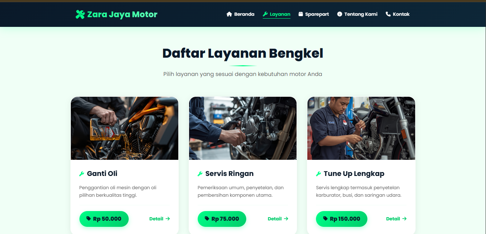
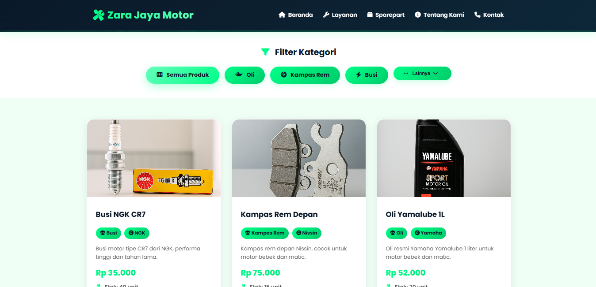
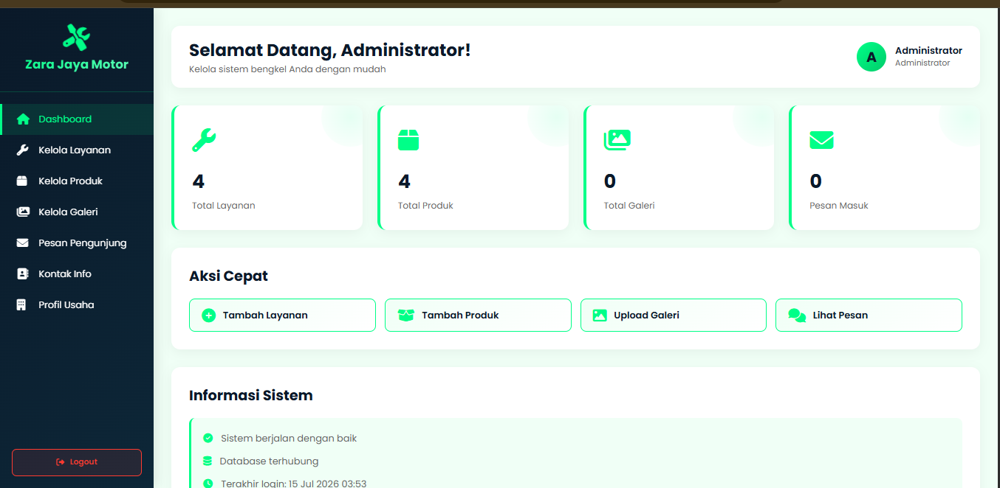

<div align="center">

# 🚗 ZJM Workshop

### Company Profile & Workshop Management Website

<p align="center">

Website company profile modern berbasis **PHP Native** dan **MySQL** yang dikembangkan untuk **Zara Jaya Motor** sebagai media promosi digital sekaligus sistem pengelolaan informasi bengkel.

</p>

<p>


</p>

<a href="https://zjm.lovestoblog.com">

</a>

</div>

---

# 📖 About

ZJM Workshop merupakan website **Company Profile** milik **Zara Jaya Motor** yang dikembangkan menggunakan **PHP Native** dan **MySQL**.

Website ini bertujuan untuk memperkenalkan layanan bengkel, produk, profil perusahaan, serta menyediakan dashboard admin untuk mengelola seluruh konten website melalui antarmuka yang sederhana.

---

# 🖼 Preview

<p align="center">

</p>

---

# ✨ Features

### 👨‍🔧 Public Website

- Landing Page
- About Us
- Workshop Services
- Product Catalog
- Product Details
- Service Details
- Contact Page
- Google Maps Integration
- Responsive Layout

### 🔐 Admin Panel

- Authentication
- Dashboard
- Product Management
- Service Management
- Website Content Management

---

# 🛠 Tech Stack

| Category | Technology |
|-----------|------------|
| Language | PHP Native |
| Database | MySQL |
| Frontend | HTML5, CSS3, JavaScript |
| CSS Framework | Bootstrap |
| Hosting | InfinityFree |

---

# 🏗 System Architecture

```text
Client
   │
   ▼
Browser
   │
   ▼
PHP Native Application
   │
   ├── Admin Panel
   ├── User Pages
   └── Configuration
   │
   ▼
MySQL Database
```

---

# 📂 Directory Structure

```text
zjm-workshop
│
├── docs/
│   ├── home.png
│   ├── layanan.png
│   ├── produk.png
│   └── admin.png
│
├── zjm/
│   ├── admin/
│   ├── config/
│   ├── image/
│   ├── about.php
│   ├── detail_layanan.php
│   ├── detail_produk.php
│   ├── index.php
│   ├── kontak.php
│   ├── layanan.php
│   └── produk.php
│
├── bengkel.sql
├── LICENSE
├── .gitignore
├── README.md
└── sszjm.png
```

---

# 🚀 Installation

## Clone Repository

```bash
git clone https://github.com/kraadev/zjm-workshop.git
```

---

## Move Project

### XAMPP

```
htdocs/zjm
```

### Laragon

```
www/zjm
```

---

## Import Database

Buat database

```
bengkel
```

Import

```
bengkel.sql
```

---

## Configure Database

Edit file konfigurasi pada

```
zjm/config/
```

```php
$host = "localhost";
$user = "root";
$password = "";
$database = "bengkel";
```

---

## Run

### User

```
http://localhost/zjm/
```

### Admin

```
http://localhost/zjm/admin/
```

---

# 📸 Screenshots

## Home


---

## Services



---

## Products



---

## Admin Dashboard



---

# 🗄 Database

Database tersedia pada repository.

```
bengkel.sql
```

---

# 🌐 Live Demo

https://zjm.lovestoblog.com

---

# 🛣 Roadmap

- [x] Landing Page
- [x] Product Management
- [x] Service Management
- [x] Contact Page
- [x] Google Maps Integration
- [x] Responsive Design
- [ ] Search Feature
- [ ] Customer Testimonials
- [ ] Booking Service
- [ ] WhatsApp Integration
- [ ] SEO Optimization
- [ ] Analytics Dashboard

---

# 🚀 Future Improvements

- REST API
- AJAX CRUD
- Authentication Enhancement
- Role Based Access Control
- Image Optimization
- Email Notification
- Progressive Web App (PWA)
- Dark Mode
- Better UI/UX
- Performance Optimization

---

# 🤝 Contributing

1. Fork repository

2. Create feature branch

```bash
git checkout -b feature/new-feature
```

3. Commit changes

```bash
git commit -m "Add new feature"
```

4. Push

```bash
git push origin feature/new-feature
```

5. Open Pull Request

---

# 📜 License

Distributed under the **MIT License**.

See `LICENSE` for more information.

---

# 👨‍💻 Author

**Kraadev**

GitHub

https://github.com/kraadev

Website

https://zjm.lovestoblog.com

---

<div align="center">

### ⭐ Don't forget to leave a Star if you like this project!

Made with ❤️ by Kraadev

</div>
